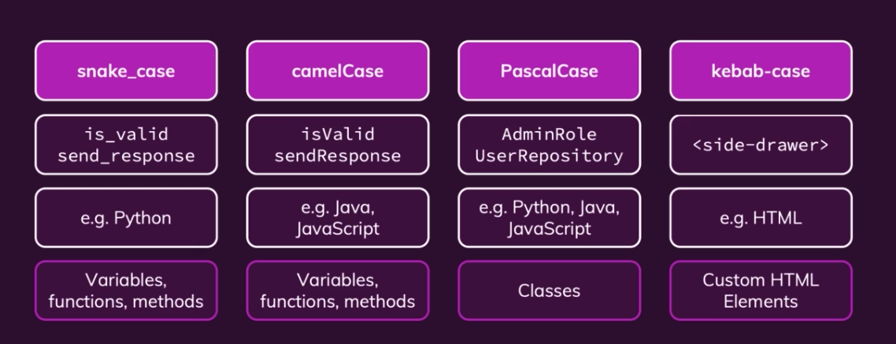

# План занятия

## Введение

- Инструменты VsCode
    - Prettier
    - Live reload + Live Server (to reload the page, when something new added)
    - Подсветка скобок с Bracket Pair Colorizer 2
- Справочник с поиском https://devdocs.io/
- Зачем нам нужен JS? (интерактив и добавление обработки действий пользователя)
- Что такое JS? Как он выполняется в браузере?
- Всегда виноваты вы - в отличии от вас машина не думает 🤖
- Не зубрим 💩, разбираемся 📚, тогда всё будет хорошо ✅

## ESM в браузере

- Вкладка Console в Chrome Devtools
    - вывод переменных
    - ошибки
- Подключение скрипта через тег script[type="module"]
- Вёдра (файлы), защитные контейнеры (модули) и бассейн кода.
- Строгий режим — "use strict"
    - use-strict.js 

## Синтаксис языка

- Основы синтаксиса: выражения, инструкции и точка с запятой
- Переменные: объявление let/const, имена переменных

- Типы примитивов.
- Вывод данных: console.log, alert
- Получение данных от пользователя: prompt и confirm
- Числа. Мат. операторы, Основные операторы.
- Встроенные объекты Math и Number
- Строки. Конкатенация и шаблонные строки. Методы строк.
- Логические операторы: &&, ||, !. 
- Преобразование типов.  

